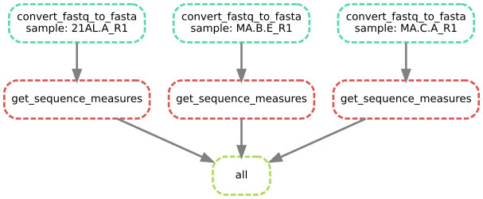

# Introduction

Presentation slides for this workshop are available [here](https://docs.google.com/presentation/d/1j3qtPVz4MRulzcZBKeumWgLvsTPlTl577YVqc6KDHPY/edit?usp=sharing).

### Making your analysis reproducible

Snakemake is a workflow-based system built to make reproducible analyses easy to build, extend and rerun.

There are several arguments for using it in your bioinformatics analyses:

* Reproducibility - preserve the exact sequence of commands used to generate certain results.
* Modularity - giving your analysis flexibility, and making it easy to follow the analysis flow.
* Ease of parallel processing - optimally use your resources with minimal effort.
* Support for managing versions in containers such as [Docker](https://www.docker.com) or [Singularity](https://sylabs.io).

With that said, I think you will find Snakemake a powerful addition in your set of analysis-tools, well worth the relatively limited time and effort needed to pick up.

# Getting started

### Installation

For Linux-users snakemake can easily be installed through your package system (`apt install snakemake` for Ubuntu-users, or Windows Linux subsystem users).

For Windows-users who don't use the [Linux subsystem](https://docs.microsoft.com/en-us/windows/wsl/install-win10), it is a bit more tricky. The recommended way is to run it through Miniconda. You find the recommended steps to install Snakemake [here](https://snakemake.readthedocs.io/en/stable/tutorial/setup.html).

### The exercise

The aim in this exercise is to layer-by-layer introduce the fundamental parts of Snakemake which covers most of the basic bioinformatics use-cases. In the end of this tutorial, you will be able to:

* Build a workflow that can take an arbitrary number of input files.
* Reprocess these in parallel, efficiently using the computer's resources.
* Merge these into a final output file.
* Generate visualizations for this output file.

All of this can subsequently be carried out in a single step, and easily be further extended.

Both the data and required scripts and snakefiles with solutions for each step are available at the [GitHub repository](https://github.com/Jakob37/SnakemakeAFriendlyIntroduction).

You can download the folder by pressing the green button "Code" and either choosing "Download ZIP" or cloning it (if you are familiar with Git).

I would encourage you to follow along with the exercise by writing out your own "snakefile", located at the top level in this directory. If you get stuck, you can then always refer to the different solutions.

### The data

Subsets of the data containing the 2500 first reads from each file are found in the GitHub repository "data" folder. For the interested, the full-sized FASTQ-files can also be downloaded from [here](https://www.dropbox.com/s/gehwyfz21xsim5q/snakemake_workshop_full_data.zip?dl=0).

The data is originally from a study investigating the gut microbiota of ants from different colonies (Benjamino and Graf, 2016). The study can be accessed [here](https://www.ncbi.nlm.nih.gov/pmc/articles/PMC4756164).

We will investigate the GC-content from the microbiome found in different ant-colonies. To do this, we will build a Snakemake pipeline that can:

1. Reprocess the data from raw FASTQ-files into FASTA-files.
2. Extract key information from these reads.
3. Summarize this information into a single matrix.
4. Generate a first overview visualization of this matrix.

This workflow will contain most of the core functionalities you need to use Snakemake to automate your own bioinformatics workflows.

For further help, take a look at the [Snakemake FAQ](https://snakemake.readthedocs.io/en/stable/project_info/faq.html), or search the internet. Most likely many others have had the same issue!

# Step 1: The Snakemake 'rule'

The Snakemake workflow consists of rules. These rules have `inputs` and `outputs`, which specify what files are expected for them to run, and which files are expected to be generated by the rule.

In each rule, a piece of code is executed. This can be written out directly in the snakemake workflow (commonly using Python or Bash), or called as an external script. Here, I have prepared a collection of Python-scripts 
to execute by the different Snakemake rules. These are a good starting point, but feel free (and encouraged!) to experiment further with extending the scripts or the workflow beyond what is presented here.

### A first snakemake rule

Here is a simple example of a snakemake rule. It reads the file `data/21AL.A_R1.fastq`, executes the Python-script `fastq_to_fasta.py`, which in turn is expected to generate output to 
`output/1_fasta/21AL.A_R1.fasta`. Beyond this, the `--max_entries` specifies how big a subset of the FASTA we should use. During the development, let's use a small number of sequences (100 in the example below).

**Note:** The backslash '\' syntax is used to break shell-commands into multiple lines. This is done here to increase readability. The python-commands can be written on a single line, with backslashes omitted.

```
rule convert_fastq_to_fasta:
    input: "data/21AL.A_R1.fastq"
    output: "output/1_fasta/21AL.A_R1.fasta"
    shell:
        """
        python3 scripts/fastq_to_fasta.py \
          --input {input} \
          --output {output} \
          --max_entries 100
        """
```

**Place this rule in your `snakefile`. At this point, this will be the only code.**

Your folder structure at this point should look something like the following (likely with some additional folders and files).
The "snakefile" will contain your newly developed Snakemake workflow.

```
snakefile
data/
    21AL.A_R1.fastq
    CT.A.E_R1.fastq
    CT.C.B_R1.fastq
    MA.B.E_R1.fastq
    MA.C.A_R1.fastq
scripts/
    combine_files.py
    fastq_to_fasta.py
    retrieve_fasta_stats.py
    visualize_summary.py
```

### Running snakemake

Now let's execute our snakemake-script. We run snakemake workflows by using the `snakemake` command. When performed with no arguments, it will look for a file named `snakefile` or `Snakefile` in your working directory. 

**Note:** The `$` sign is used in this tutorial to show the line where the command is executed. When running it, you only need to write out "snakemake".

```
$ snakemake
```

If you want to run the solutions provided in the `snakefile/` directory, they can be executed one and one using the `--snakefile` command, where you can state custom locations for the snakefile. 

```
$ snakemake --snakefile snakefiles/1_single_rule_snakefile
```

If your current path isn't correct relative to the input files, you might encounter an error like the following. If so, make sure that you are next to the "data" folder, and that the file "21AL.A_R1.fastq" is one of the files in this folder.

```
snakemake
Building DAG of jobs...
MissingInputException in line 1 of /home/user/snakemake_workshop/snakefile:
Missing input files for rule convert_fastq_to_fasta:
"data/21AL.A_R1.fastq"
```

If run successfully, you will obtain output looking something like the following:

```
$ snakemake
Building DAG of jobs...
Using shell: /bin/bash
Provided cores: 12
Rules claiming more threads will be scaled down.
Job counts:
        count   jobs
        1       convert_fastq_to_fasta
        1

[Tue Jan 26 09:12:04 2021]
rule convert_fastq_to_fasta:
    input: data/21AL.A_R1.fastq
    output: output/1_fasta/21AL.A_R1.fasta
    jobid: 0

[Tue Jan 26 09:12:04 2021]
Finished job 0.
1 of 1 steps (100%) done
Complete log: .../210125_snakemake_workshop/.snakemake/log/2021-01-26T091204.673160.snakemake.log
```

We see that Snakemake had up to 12 cores to run in parallel for the job (`Provided cores: 12`). We also see that one job was executed, `convert_fastq_to_fasta`, which was only executed a single time.
We also obtained a path to the error log (`2021-01-26T091204.673160.snakemake.log`). Here, further output and helpful error messages could often be found.

If the command failed to run successfully, carefully inspect the errors obtained in the terminal or in the error log. Often, the error is related to some simple syntax mistake, or that the files are not where you expect them to be compared to the current working directory.

## Exercises

1. Try to run the `snakemake` command. Inspect the output, and see if you understand the different parts.
2. Inspect the "output" folder. What do you see there? Is it what you would expect?
3. Try running `snakemake` again. What happened? Snakemake can figure out what rules need to be run to generate the desired output. If nothing has changed, it will not re-run any code if not prompted to.
4. Try running `snakemake` with the `-F` flag (`snakemake -F`). What happened now? The "-F" flag allows you to force-run the workflow, even though no files have changed.
5. Try using the `-n` flag. This will give you a dry-run, which is useful to verify that there are no apparent issues with the snakemake workflow.
6. Try changing your Snakemake script to include only 10 entries. Rerun. Verify in your output that the output FASTA now contains only 10 entries (20 lines). 
   Do you need to force the run for it to process the data after doing this change? 

# Step 2: A multi-rule workflow and the configuration file

Now we will run a sequence of two commands - a mini pipeline. To do this,
we will need to add two things. 

* Snakemake files generally include a special
rule at the top called `rule all`, where you tell Snakemake what final output
files you want to obtain are. Based on what you specify here, Snakemake will then deduce which of the other rules it needs to run to generate this output.
* Furthermore, we will run a second command used to calculate some statistics for each FASTA-sequence, including the GC-content. 
  This is of particular interest in this dataset, as we know that the GC-content varies between species. But does it vary between different microbiomes?

The second command takes the output from the first command as input (`output/1_fasta/21AL.A_R1.fasta`). It then is expected to produce the output file `output/2_summary/21AL.A_R1.tsv`. This is provided as the input to `rule all`, as this is the final provided output.

**Note:** The output location is completely flexible, as long as you keep it consistent between the rules. I have chosen to use the folder structure `output/2_summary` as a way to easily
overview the output.

Beyond this, a configuration file has been added (`config.yaml`) to provide a more flexible way to change input-parameters (such as the `--max_entires`). More on this below.

```
configfile: 'config.yaml'

rule all:
    input: 'output/2_summary/21AL.A_R1.tsv'

rule convert_fastq_to_fasta:
    input: 'data/21AL.A_R1.fastq'
    output: 'output/1_fasta/21AL.A_R1.fasta'
    shell:
        """
        python3 scripts/fastq_to_fasta.py \
          --input {input} \
          --output {output} \
          --max_entries {config[settings][max_nbr_seqs]}
        """

rule retrieve_fasta_stats:
    input: 'output/1_fasta/21AL.A_R1.fasta'
    output: 'output/2_summary/21AL.A_R1.tsv'
    shell:
        """
        python3 scripts/retrieve_fasta_stats.py \
          --input {input} \
          --output {output}
        """
```

Configuration file content `config.yaml`. Should be located next to the snakefile.

```
settings:
  max_nbr_seqs: 100
```

The sequence of events when executing this script will be:
1. Ask the rule all - which files do I need to generate?
Answer: `output/2_summary/21AL.A_R1.tsv`
2. Are there any commands that can provide this? Yes, rule `retrieve_fasta_stats`.
3. Is the input to this rule (`output/1_fasta/21AL.A_R1.tsv.fasta`) available on disk? No -
then are there any rules that can generate it? Yes, rule `convert_fastq_to_fasta`.
So, we need to execute that one first.
4. Is the input file to `convert_fastq_to_fasta` - `data/21AL.A_R1.tsv.fastq` available? Yes, it is present in the input data. Perfect, then we are all set.
5. Processing starts, running first rule `convert_fastq_to_fasta` and next rule `retrieve_fasta_stats`, providing the desired output to `rule all`.

### Configuring your analysis

In addition, we included a reference to a configuration file `config.yaml`. This file should be located in the same folder as your snakefile, as outlined above.

We now provide the value for the `convert_fastq_to_fasta` command option `--max_entries` from the configuration file.
It is a good habit to separate out settings we might 
want to change to the configuration file such that we later can avoid doing changes directly in the snakefile when we only want to change parameter values.

The value is retrieved in the code the following way:

```
{config[settings][max_nbr_seqs]}
```

Note that there are no quotation-marks in this case. This is because the variables are obtained within the shell command. 
If used outside the shell command (surrounded by the triple \"\"\"), you will need to use quotation marks as such: 

```
config["settings"]["max_nbr_seqs"]
```

This is a tricky part to keep track of when working with Snakemake. Sometimes you write Python-code in the snakemake-workflow itself,
and sometimes you write shell-code within the different rules!

## Exercises:

1. After running your mini-pipeline, try rerunning it. What happens?
2. Next, try to remove the intermediate output file `output/1_fasta/21AL.A_R1.tsv.fasta` and try to rerun. What happens?
3. Try changing the `max_nbr_seqs` in the config file (for instance to 15), and verify that the number of entries in the final output changes.
4. (Might not work on Windows) The commands `snakemake --dag | dot -Tsvg > dag.svg` can be used to generate a graph that illustrates the different executed commands. Can you get it to run? Does the graph look like you expected? (It is trivial at this point, but will be more useful later in this exercise).
5. (Bonus) Try coming up with some further way to process the resulting output. Add another rule taking output from either the `convert_fastq_to_fasta` or `retrieve_fasta_stats` rules.
   Rerun this extended workflow. Ideas for further extension could be
    * Gather only the FASTA-IDs in a separate file
    * Make a summary of the summary files (the `.tsv` outputs), with the average numbers of nucleotides and GC-content provided.
6. (Bonus) If you are proficient in Python, feel free to further extend the `retrieve_fasta_stats.py` script to calculate any sequence characteristics you find interesting.

Illustration of the workflow at this point (generated using the `--dag` flag, as outlined in the exercise):


# Step 3 - Multiple input files

Now, you have seen how we can chain multiple rules for one input file. More commonly, we have multiple input files. This is where Snakemake really starts to shine.
Let's see how to run the rules for three files, converting all three of them to FASTA-files and calculating the GC-values of their sequences.

Remember that Snakemake is written in Python, so you are free to use common Python code throughout the Snakemake scripts. 
The most straightforward way to process multiple files is to include the sample-specific part of the filenames in a Python list, 
and then use the command `expand` to tell the Snakemake rules to look for all these file patterns, as will be shown below.

**Note:** Snakemake expects all your sample-names to follow the same overall pattern, with one variable part being unique for each sample. 

```
samples = [21AL.A_R1, MA.B.E_R1, MA.C.A_R1]
```

### Managing a large number of samples

This approach quickly becomes overwhelming if you run many samples, and a more general approach is often desirable. 
Snakemake provides this through the function `glob_wildcards`.
Here, Snakemake looks for sample names matching a pattern in the file names, and uses this to find the pattern of all sample-files in a folder.

**Note:** The "," after the "samples" is in this case necessary, as this converts the output from `glob_wildcards` into list-format

```
samples, = glob_wildcards("data/{sample}.fastq")
```

We can test this by adding a `print` statement on the second row `print(samples)`, and try running. Remember - we can use standard Python within the Snakemake workflow.

### Running the workflow for multiple files

Now we are ready to run. For now, we use the smaller set of three file-names as this makes it easier to quickly re-run the workflow during development.

Furthermore, we need to introduce a new concept to help snakemake understand how to handle the sample-names - the `expand` command and the `{...}` patterns in the sample names.

Instead of explicitly writing out exact sample-paths in the rules as before, we now use the `{...}` pattern, in this case `{sample}`. 
This is used to assign the different sample-names as specified by the `samples` list. 
To do this we use the `expand` command. Here, Snakemake will expand the list `samples` into the pattern `sample` and generate three different full file-paths: 

`output/2_summaries/21AL.A_R1.tsv`, `output/2_summaries/MA.B.E_R1.tsv` and `output/2_summaries/MA.C.A_R1.tsv`.

Snakemake can then figure out the expected names of the prior rules, and inserting that in the `{sample}` part of each input and output.
After updating the workflow, it looks the following way:

```
configfile: "config.yaml"
samples = ["21AL.A_R1", "MA.B.E_R1", "MA.C.A_R1"]

rule all:
    input:
        expand("output/2_summary/{sample}.tsv", sample=samples)

rule convert_fastq_to_fasta:
    input: "data/{sample}.fastq"
    output: "output/1_fasta/{sample}.fasta"
    shell:
        """
        python3 scripts/fastq_to_fasta.py \
          --input {input} \
          --output {output} \
          --max_entries {config[settings][max_nbr_seqs]}
        """

rule get_sequence_measures:
    input:
        in_fasta="output/1_fasta/{sample}.fasta"
    output:
        out_fasta="output/2_summary/{sample}.tsv"
    shell:
        """
        python3 scripts/retrieve_fasta_stats.py \
          --input {input.in_fasta} \
          --output {output.out_fasta}
        """
```

## Exercise

1. Try changing the list-syntax such that all five samples are run.
2. Try the glob-syntax, and see if you can run all of the files.
3. Carefully inspect the workflow, and see what happens if you remove certain output files. What commands are executed in each case?
4. Try running it one one core or multiple cores using the `--cores` command. Increase the `--max_entries` setting to better see the difference.
5. (Likely not working on Windows) Try using the command `snakemake --dag | dot -Tsvg > dag.svg` to generate a graph that illustrates the different executed commands. Does the graph look like you expected?

Running it will generate the following graph.



# Step 4 - Combining multiple files into one

At this point we will end up with a set of processed files, each containing useful information about each FASTA file. 
It is still a bit difficult to overview though, and a common task is to combine these different files into a single one, 
which then could be used for further inspection, statistics and visualizations.

To achieve this, we initially process each file separately, but then at the new rule `combine_sequence_measures` gather the
input from all these parallel rules. This we do by moving the `expand` statement into the input of this rule from the `rule all`.
We change the `rule all` expected output, as now the final output is a single output file.

After doing these changes in the previous code, the workflow will look the following way.

```
configfile: "config.yaml"
samples = ["21AL.A_R1", "MA.B.E_R1", "MA.C.A_R1"]

rule all:
    input:
        "output/3_combined/combined.tsv"

rule convert_fastq_to_fasta:
    input: "data/{sample}.fastq"
    output: "output/1_fasta/{sample}.fasta"
    shell:
        """
        python3 scripts/fastq_to_fasta.py --input {input} --output {output} --max_entries {config[settings][max_nbr_seqs]}
        """

rule get_sequence_measures:
    input:
        in_fasta="output/1_fasta/{sample}.fasta"
    output:
        out_fasta="output/2_summary/{sample}.tsv"
    shell:
        """
        python3 scripts/retrieve_fasta_stats.py --input {input.in_fasta} --output {output.out_fasta}
        """

rule combine_sequence_measures:
    input: expand("output/2_summary/{sample}.tsv", sample=samples)
    output: "output/3_combined/combined.tsv"
    shell:
        """
        python3 scripts/combine_files.py --input {input} --output {output}
        """
```

Now we have successfully generated a joint file with statistics calculated for each of the original files.

Here is the graphical illustration of the workflow:


## Exercises

1. Again, try adjusting the included samples, and the included number of used sequences `--max_entries`. How is this reflected in the output?
2. (Bonus - Advanced) Expand the workflow by calculating average GC-values for each sample. Do this by first calculating separate values for each sample, and then merging them by an additional command,
which similarly to the `combine_sequence_measures` collects outputs from all the files, and produces one single output. This can be done by an external script in any language, or directly
   in the snakemake file using `bash` or `python` (in the latter case, you likely need to replace `shell` with `run`). 

A good starting point for (2) could be something like the following. Normal Python code can be written after `run`. The input files
could be loaded, and the average GC calculated and printed as a single number. Here, also the `wildcards` syntax is presented, which
can be used to obtain the current sample-name from within the code.

These outputs could then be combined in another rule.
```
rule get_averages:
    input:
        in_sum="output/2_summary/{sample}.tsv"
    output:
        out_sum="output/4_sample_sum/{sample}.sample_sum.tsv"
    run:
        with open(output.out_sum, 'w') as out_fh:
            print("test output", file=out_fh)
```

3. (Bonus, probably not working on Windows) If carrying out the exercise above, try also using the command `snakemake --dag | dot -Tsvg > dag.svg` to inspect the resulting graph.

# Step 5 - Visualizing and wrapping up

As a final step, we would like to generate visualizations from these measures. Here, we could commonly also calculate statistics, or combine them with other data.
Furthermore, more settings are retrieved from the `config.yaml`-file, to allow customizing the final output visualization.

The additional rule takes the combined summary table, and uses this to produce a Seaborn histogram plot, illustrating the 
distribution of GC-values within each sample.

Not much new here, just wrapping up with showing that the visualization output can be the final output.

Note that for the visualization Python-script to run you will need to have the Python package `seaborn` installed.
This can be installed with either `conda install seaborn` if using a conda environment, or `pip install seaborn` otherwise.

```
configfile: "config.yaml"
samples = ["21AL.A_R1", "MA.B.E_R1", "MA.C.A_R1"]

rule all:
    input:
        "output/4_visuals/visual_summary.png"

rule convert_fastq_to_fasta:
    input: "data/{sample}.fastq"
    output: "output/1_fasta/{sample}.fasta"
    shell:
        """
        python3 scripts/fastq_to_fasta.py --input {input} --output {output} --max_entries {config[settings][max_nbr_seqs]}
        """

rule get_sequence_measures:
    input:
        in_fasta="output/1_fasta/{sample}.fasta"
    output:
        out_fasta="output/2_summaries/{sample}.tsv"
    shell:
        """
        python3 scripts/retrieve_fasta_stats.py --input {input.in_fasta} --output {output.out_fasta}
        """

rule combine_sequence_measures:
    input: expand("output/2_summaries/{sample}.tsv", sample=samples)
    output: "output/3_combined/combined.tsv"
    shell:
        """
        python3 scripts/combine_files.py --input {input} --output {output}
        """

rule visualize_summary:
    input: "output/3_combined/combined.tsv"
    output: "output/4_visuals/visual_summary.png"
    shell:
        """
        python3 scripts/visualize_summary.py \
            --input {input} \
            --output {output} \
            --nbr_bins {config[plotting][number_bins]} \
            --nbr_cols {config[plotting][number_cols]} \
            --title {config[plotting][title]}
        """
```

Config file:

```
settings:
  max_nbr_seqs: 10
plotting:
  number_bins: 20
  number_cols: 4
  title: "GC-distributions"
```


## Exercises

1. Run the workflow, and inspect the different outputs. Does there seem to be a systematic difference in GC-contents?
2. Try to adjust the different settings within the config file. Inspect whether the GC-contents seem to change.
3. (Bonus - Advanced) If comfortable with Python (or R) make another visualization script to generate more output visualizations. 
   This could for instance visualize the average GC-contents from each file as boxplots.
4. (Bonus - Advanced) In a separate step, calculate whether there is a statistical difference in the GC-contents obtained from the different files.

# More complex examples, and reading materials

With that, we conclude the exercise. Hope you learned things which will be of use in your future analyses!

These are some of the fundamentals. Of course, there are further variations on this, and in real life you might need particular solutions 
for particular situations. Worry not - most likely many other people have encountered the same issues before. 
If you google well, you will most likely find the answers. Also, here is a great page summarizing many of the common questions you might encounter:

https://snakemake.readthedocs.io/en/stable/project_info/faq.html

A more extensive tutorial is found here:

https://snakemake.readthedocs.io/en/stable/tutorial/tutorial.html#tutorial

Also, if you want to see a more extensive real-world example of Snakemake workflow, the NBIS organization (the National Bioinformatics Infrastructure in Sweden) has one here designed for metagenomics analyses:

https://github.com/NBISweden/nbis-meta

Feel free to contact me with any issues or questions abut the tutorial.

Best of luck!